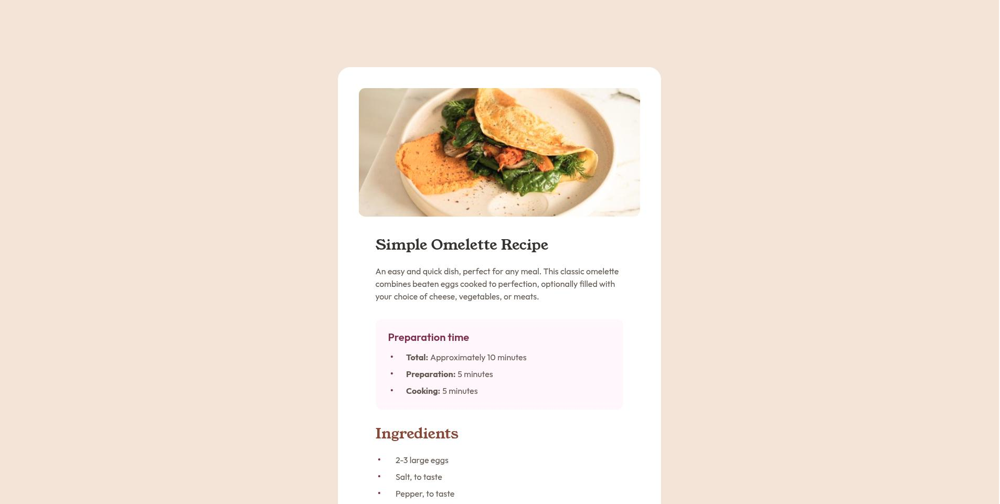

# Frontend Mentor - Recipe page solution

This is a solution to the [Recipe page challenge on Frontend Mentor](https://www.frontendmentor.io/challenges/recipe-page-KiTsR8QQKm). Frontend Mentor challenges help you improve your coding skills by building realistic projects. 

## Overview

### Screenshot

## My process

### Built with
... Vite and some basic html5/css skills

### What I learned
Getting ordered and unordered lists exactly as per design proved to be challenging. 
Learned a couple of tricks to handle such situations.  

## Author
- Website - [Resume](https://piotrniezgoda.pl/)
- Frontend Mentor - [@niezgoda-piotr](https://www.frontendmentor.io/profile/niezgoda-piotr)

## Acknowledgments
Thanks [frontendmentor.io](https://www.frontendmentor.io/)
So I can focus on implementation rather than idea generation.
